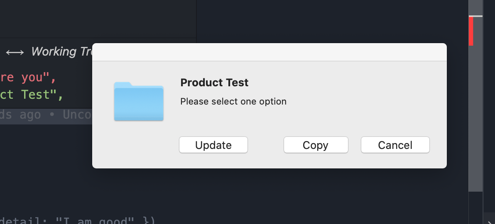

# NODE-DIALOG

Native dialog for mac than can be prompt from node

# How To Use

```.js
const dialog = require("../index");

 const response =  dialog.showSync({
      title: "Product Test",
      detail: "Please select one option",
      buttons: ["Cancel", "Copy", "Update"]
    })
  );


```



**response** can be `0,1,2` depending on the order of button

## Check example.js in test folder
